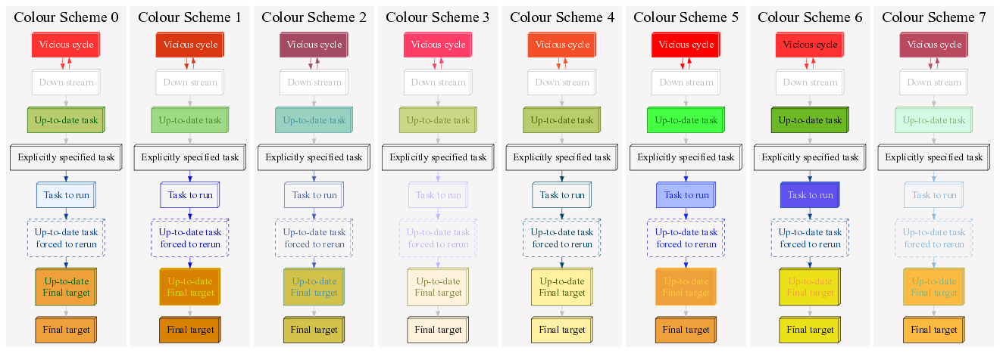

.. include:: ../../global.inc

.. _flowchart_colours:

******************
Flowchart colours
******************

* See :ref:`code <flowchart_colours.code>` for experimenting with colours 

The appearance of Ruffus flowcharts produced by :ref:`pipeline_printout_graph <pipeline_functions.pipeline_printout_graph>` 
can be extensively customised.

This is mainly controlled by the :ref:`user_colour_scheme <pipeline_functions.pipeline_printout_graph.user_colour_scheme>`  (note UK spelling) parameter 

Example:

    Use colour scheme index  = 1
    ::

        pipeline_printout_graph ("flowchart.svg", "svg", [final_task],
                                 user_colour_scheme = {
                                                        "colour_scheme_index" :1,
                                                        "Pipeline"      :{"fontcolor" : '"#FF3232"' },
                                                        "Key"           :{"fontcolor" : "Red",      
                                                                          "fillcolor" : '"#F6F4F4"' },
                                                        "Task to run"   :{"linecolor" : '"#0044A0"' },
                                                        "Final target"  :{"fillcolor" : '"#EFA03B"',
                                                                          "fontcolor" : "black",    
                                                                          "dashed"    : 0           }
                                                       })

There are 8 colour schemes by setting ``"colour_scheme_index"``:
    ::

        pipeline_printout_graph ("flowchart.svg", "svg", [final_task],
                                  user_colour_scheme = {"colour_scheme_index" :6})

These colours were chosen after much fierce arguments between the authors and friends, and much
inspiration from  http://kuler.adobe.com/#create/fromacolor. Please
feel free to submit any additional sets of colours for our consideration.

(Click here for image in :download:`svg <../../images/flowchart_colour_schemes.svg>`.)

