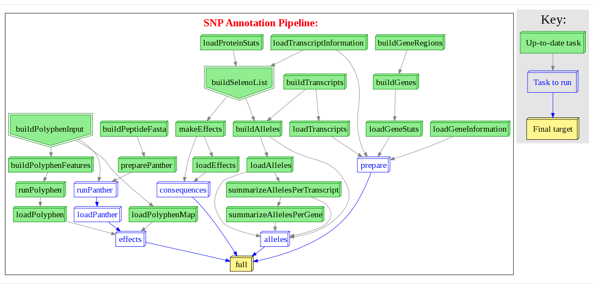

.. include:: global.inc
******************************************************
Hall of Fame: User contributed flowcharts
******************************************************
Please contribute your own work flows in your favourite colours with (an optional) short description
to email: ruffus_lib at llew.org.uk

^^^^^^^^^^^^^^^^^^^^^^^^^^^^^^^^^^
RNASeq pipeline
^^^^^^^^^^^^^^^^^^^^^^^^^^^^^^^^^^
    http://en.wikipedia.org/wiki/RNA-Seq
    
    Mapping transcripts onto genomes using high-throughput sequencing technologies.
    
    (:download:`Original svg image <images/gallery/gallery.rna_seq.svg>`.)
    
    .. image:: images/gallery/gallery.rna_seq.png
    

^^^^^^^^^^^^^^^^^^^^^^^^^^^^^^^^^^^^^^^^^^^^^^^^^^^
non-coding evolutionary constraints
^^^^^^^^^^^^^^^^^^^^^^^^^^^^^^^^^^^^^^^^^^^^^^^^^^^
    http://en.wikipedia.org/wiki/Noncoding_DNA
    
    Non-protein coding evolutionary constraints in different species.
    
    (:download:`Original svg image <images/gallery/gallery.dless.svg>`.)
    
    .. image:: images/gallery/gallery.dless.png

^^^^^^^^^^^^^^^^^
SNP annotation
^^^^^^^^^^^^^^^^^
Single nucleotide annotation

http://en.wikipedia.org/wiki/Single-nucleotide_polymorphism

Population variation across genomes.

(:download:`Original svg image <images/gallery/gallery.snp_annotation.svg>`.)

Using "pseudo" targets to run only part of the pipeline

(:download:`Original svg image <images/gallery/gallery.snp_annotation_consequences.svg>`.)

.. image:: images/gallery/gallery.snp_annotation_consequences.png

^^^^^^^^^^^^^^^^^^^^^^^^^^^^^^^^^^
Highthroughput genome annotation
^^^^^^^^^^^^^^^^^^^^^^^^^^^^^^^^^^

    (:download:`Original svg image <images/gallery/gallery.big_pipeline.svg>`.)
    
    .. image:: images/gallery/gallery.big_pipeline.png

