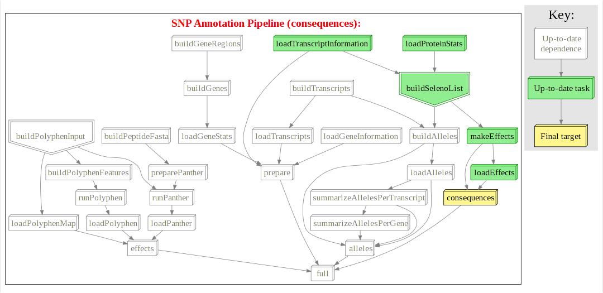

.. include:: global.inc

.. image:: images/logo.jpg

******************************************************
Hall of Fame
******************************************************
Please contribute your own work flows in your favourite colours with (an optional) short description
to email: ruffus_lib at llew.org.uk

^^^^^^^^^^^^^^^^^^^^^^^^^^^^^^^^^^
RNASeq pipeline
^^^^^^^^^^^^^^^^^^^^^^^^^^^^^^^^^^
    http://en.wikipedia.org/wiki/RNA-Seq

    Mapping transcripts onto genomes using high-throughput sequencing technologies (:download:`svg <images/gallery/gallery_rna_seq.svg>`).

    .. image:: images/gallery/gallery_rna_seq.png
       :target: _downloads/gallery_rna_seq.svg

^^^^^^^^^^^^^^^^^^^^^^^^^^^^^^^^^^^^^^^^^^^^^^^^^^^
non-coding evolutionary constraints
^^^^^^^^^^^^^^^^^^^^^^^^^^^^^^^^^^^^^^^^^^^^^^^^^^^
    http://en.wikipedia.org/wiki/Noncoding_DNA

    Non-protein coding evolutionary constraints in different species (:download:`svg <images/gallery/gallery_dless.svg>`).

    .. image:: images/gallery/gallery_dless.png
       :target: _downloads/gallery_dless.svg

^^^^^^^^^^^^^^^^^
SNP annotation
^^^^^^^^^^^^^^^^^
Predicting impact of different Single Nucleotide Polymorphisms

http://en.wikipedia.org/wiki/Single-nucleotide_polymorphism

Population variation across genomes (:download:`svg <images/gallery/gallery_snp_annotation.svg>`).

.. image:: images/gallery/gallery_snp_annotation.png
       :target: _downloads/gallery_snp_annotation.svg

Using "pseudo" targets to run only part of the pipeline (:download:`svg <images/gallery/gallery_snp_annotation_consequences.svg>`).

^^^^^^^^^^^^^^^^^^^^^^^^^^^^^^^^^^
Chip-Seq analysis
^^^^^^^^^^^^^^^^^^^^^^^^^^^^^^^^^^

Analysing DNA binding sites with Chip-Seq
http://en.wikipedia.org/wiki/Chip-Sequencing

    (:download:`svg <images/gallery/gallery_big_pipeline.svg>`)

    .. image:: images/gallery/gallery_big_pipeline.png
       :target: _downloads/gallery_big_pipeline.svg

